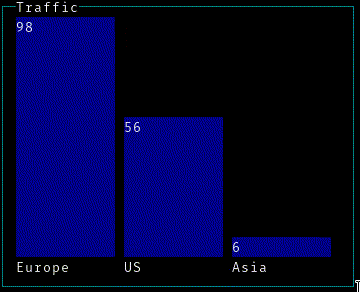

# gobless
Build beautiful terminal dashboards and GUIs in Golang. 


The name was intended to be pronounced _go-bless_ due to the inspiration from [blessed-contrib](https://github.com/yaronn/blessed-contrib), but _gob-less_ is kind of funnier, so we'll go with that instead.

Thanks to [tcell](https://github.com/gdamore/tcell), full cross-platform terminal support is expected.

## Requirements

- Go 1.10+
- Terminal with:
  - Unicode support
  - 256 color support

## Get Started

```bash
go get github.com/liamg/gobless
```

You can get started by experimenting with the various [examples](_examples/).

## Components

### Text Box


```golang
textbox := gobless.NewTextBox()
textbox.SetWidth(64)
textbox.SetHeight(10)
helloTextbox.SetTextWrap(true)
helloTextbox.SetText(`Lorem ipsum...`)
```

Full example code is [here](_examples/textbox).

### Bar Chart



```golang
chart := gobless.NewBarChart()
chart.SetTitle("Traffic")
chart.SetWidth(40)
chart.SetHeight(15)
chart.SetYScale(100)
chart.SetBar("Europe", 60)
chart.SetBar("US", 72)
chart.SetBar("Asia", 37)
```

Full example code is [here](_examples/barchart).

### Progress Bar

### Sparklines

### Line Chart

### Block Chart

(kind of like blessed-contrib's stacked gauge)

### Donut

### Log

### Table

### Tree

### Dot Matrix

The dot matrix component allows you set blocks of colour at double the resolution of the terminal characters, using the various partial quadrant unicode characters.

It includes utility methods for drawing lines, circles etc.


Example code is [here](_examples/dotmatrix).

## Layout System

Gobless includes a built-in CSS style 12 column nestable grid layout system. This uses `Rows` and `Columns` (which are themselves components) to quickly build a UI with minimal effort. 


```golang
rows := []gobless.Component{
	gobless.NewRow(
		gobless.GridSizeHalf,
		gobless.NewColumn(
			gobless.GridSizeTwoThirds,
			helloTextbox,
		),
		gobless.NewColumn(
			gobless.GridSizeOneThird,
			gobless.NewRow(
				gobless.GridSizeFull,
				gobless.NewColumn(
					gobless.GridSizeFull,
					chart,
					chart2,
				),
			),
		),
	), 
	gobless.NewRow(
		gobless.GridSizeHalf,
		gobless.NewColumn(
			gobless.GridSizeFull,
			quitTextbox,
		),
	),
}

gui.Render(rows...)
```

You can also detect [resize events](#events) and automatically resize the layout of your components if you wish.

```golang
gui.HandleResize(func(event gobless.ResizeEvent) {
	gui.Render(rows...)
})
```

A [full example](_examples/gridlayout) is also available.

Alternatively, if you need to, you can position components absolutely using the `.SetX()`, `.SetY()`, `.SetWidth()` and `.SetHeight()` methods, omitting the presence of rows/columns entirely.

## Events

Gobless can currently detect two types of events:

### Key Press Events

You can add your own handlers for key presses, utilising the `gobless.Key*` constants.

For example, to stop rendering the GUI when the user presses `CTRL` + `Q`, you could do:

```
gui.HandleKeyPress(gobless.KeyCtrlQ, func(event gobless.KeyPressEvent){
		gui.Close()
})
```

## Terminology

- A *Cell* refers to an individual terminal cell, in which a single character can be drawn.
- A *Tile* refers to a rectangular grouping of cells.
- A *Component* is an entity which provides a tile - or tiles - to the GUI to render. A bar chart, for example.
